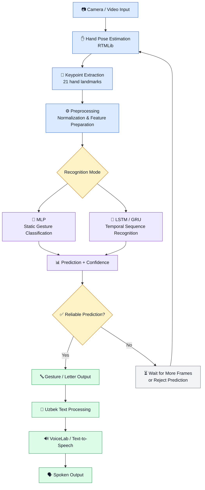

## 🧠 System Architecture

## Project structure

The repository is organized by responsibility so an entrypoint can be found
without searching the whole tree:

```text
pose/                  camera runtime, landmark collection and pose utilities
features/              feature extraction and temporal feature definitions
training/              dataset preparation, training and evaluation commands
inference/             reusable inference adapters and prediction helpers
data/
  dataset.csv          canonical labeled Uzbek alphabet dataset
  processed/           reproducible splits, metrics and plots
  external/            downloaded third-party datasets and source notes
  dynamic/             locally recorded temporal sequences
models/
  gesture_extra_trees_full.pkl  active production alphabet model
  gesture_extra_trees.pkl       active held-out-evaluation fallback
  pose/                          RTMLib pose checkpoint
archive/
  legacy-models/       models no longer selected by the camera runtime
  legacy-data/         superseded datasets kept for traceability
api/                   optional API entrypoint
```

Primary commands:

```bash
# Live alphabet recognition
/usr/local/bin/python3.13 pose/webcam_predict.py --camera 0

# Production model training from the canonical dataset
/usr/local/bin/python3.13 training/train_production_full.py

# Held-out evaluation
/usr/local/bin/python3.13 training/train_extra_trees.py
```

The camera selects `models/gesture_extra_trees_camera.pkl` only when a
calibration model exists; otherwise it selects the full production model and
then the held-out fallback. Historical models are not loaded automatically.

The **Uzbek Sign Language AI** project aims to recognize hand gestures, convert them into Uzbek text, and optionally generate speech.

### 🔄 End-to-End Workflow



### 🧩 Component Responsibilities

| Component | Responsibility |
|---|---|
| Camera / Video | Captures hand movements |
| RTMLib | Detects hand landmarks |
| Preprocessing | Prepares and normalizes coordinates |
| MLP | Classifies a static hand pose |
| LSTM / GRU | Learns patterns across video frames |
| Confidence Filter | Rejects uncertain or unstable predictions |
| Uzbek Text Processing | Combines recognized outputs into text |
| VoiceLab | Converts supported text into speech |

### 🏋️ Model Training Strategy

1. Prepare and validate labeled keypoint data.
2. Establish a baseline using the existing Random Forest model.
3. Train and evaluate an MLP model on the same data split.
4. Collect labeled video sequences for dynamic gesture recognition.
5. Experiment with LSTM or GRU when sequence data is available.
6. Evaluate on unseen recordings and real camera input.
7. Add confidence filtering and error analysis before enabling speech output.

### ⚠️ Current Development Status

- **Implemented:** A Random Forest baseline with 93.29% test accuracy on the existing keypoint dataset.
- **Dataset:** 6,547 samples across 29 classes, each represented by 21 hand landmarks.
- **Planned:** Deep Learning experiments, real-time camera integration, temporal gesture recognition, confidence filtering, and speech output.

The old static classifier files were removed after the external camera test
failed. The downloaded Uzbek dynamic checkpoint is kept separately under
`data/external/uzslr-isolated-dynamic/best_model.pth`. It uses 32-frame
MediaPipe Holistic input and cannot be substituted into the old RTMLib static
camera script without an adapter.

The alphabet camera path now uses an adaptive confidence-aware landmark
smoother, short missing-frame hold, runtime feature-layout validation, and an
on-screen FPS indicator. A letter is shown only when the top probability is at
least 55%, it beats the second choice by at least 12 percentage points, and
the same candidate remains stable for four processed frames. Otherwise the
screen shows `Noaniq` instead of turning an uncertain guess into a letter. It
remains alphabet-only; word and sentence decoding are intentionally not
enabled in this stage.

If the live model does not recognize your hand, collect camera-native
calibration samples:

```bash
/usr/local/bin/python3.13 pose/camera_calibration.py --samples-per-label 100
```

Press `S` to collect the current letter, `N` to move to the next letter, and
`Q` to stop. Then train the camera-calibrated model:

```bash
/usr/local/bin/python3.13 training/train_camera_calibrated.py
```

The calibration model is saved as `models/gesture_extra_trees_camera.pkl` and
is selected automatically by the camera script. Existing datasets remain
intact.

Without manual camera collection, the current labeled Uzbek dataset can be
used to build a production model:

```bash
/usr/local/bin/python3.13 training/train_production_full.py
```

This trains `models/gesture_extra_trees_full.pkl` on all 6,547 labeled rows.
The 80/20 held-out evaluation remains documented in
`data/processed/metrics_extra_trees.txt` (93.75%); the full-data production
model itself must not be reported as a new independent test score.

### iPhone camera

On macOS, enable **Continuity Camera** on the iPhone and keep it near the Mac.
Then list the camera devices:

```bash
/usr/local/bin/python3.13 pose/webcam_predict.py --list-cameras
```

If the iPhone appears as index `1`, run:

```bash
/usr/local/bin/python3.13 pose/webcam_predict.py --camera 1
```

For convenience, `0.5` is accepted as an explicit iPhone alias and directly
uses the macOS Continuity Camera index `1` without probing other devices:

```bash
/usr/local/bin/python3.13 pose/webcam_predict.py --camera 0.5
```

Use the same `--camera 1` option while collecting calibration data:

```bash
/usr/local/bin/python3.13 pose/camera_calibration.py --camera 1 --samples-per-label 100
```

The index depends on macOS and connected devices; use the list command instead
of assuming it is always `1`.

The camera helper now tests that each index returns a real frame, not only that
OpenCV reports it as open. It uses `CAP_ANY` because some macOS builds open
Continuity Camera through that backend while AVFoundation alone returns an
empty first frame. Keep the iPhone unlocked, near the Mac, and select the
index printed by `--list-cameras`.

### sign2text compatibility mode

The public [`uzibytes/sign2text`](https://github.com/uzibytes/sign2text)
artifacts are preserved under `data/external/sign2text/`. They use 21
MediaPipe hand landmarks and bounding-box-minimum features, which is a
different contract from the default Uzbek wrist-relative RTMLib model. A
separate experimental mode applies that preprocessing to RTMLib coordinates:

```bash
/usr/local/bin/python3.13 pose/webcam_predict.py --camera 1 --model sign2text
```

This mode is a compatibility experiment, not an Uzbek accuracy claim. Its
published classes are English A-Z plus words, and the source model has no
verified Uzbek label mapping. The default command remains the Uzbek model.

## Dynamic recognition development

The existing `data/dataset.csv` is preserved as a static baseline. Dynamic
recognition uses landmark sequences rather than a single frame:

```bash
/usr/local/bin/python3.13 pose/dynamic_recorder.py --label salom --signer signer_01 --view front
```

Press `Space` to start and stop one sequence, then `Q` to exit. Sequences are
stored under `data/dynamic/` with labels and signer/view metadata.

After collecting enough isolated-word sequences:

```bash
/usr/local/bin/python3.13 training/train_dynamic.py
```

The dynamic model is a temporal Transformer baseline. It is intentionally
trained on Uzbek-labeled local data: public ASL datasets or checkpoints can
help with pose/video pretraining, but their labels and sign semantics cannot
be used as a drop-in Uzbek sign-language translator.

After training, run the rolling-window camera demo:

```bash
/usr/local/bin/python3.13 pose/webcam_dynamic.py
```

## Public Uzbek dynamic checkpoint

An additional pretrained Uzbek isolated-sign model from
[`akkomron/uzslr-isolated-dynamic`](https://github.com/akkomron/uzslr-isolated-dynamic)
is stored separately under `data/external/uzslr-isolated-dynamic/`. It predicts
50 signs from 32-frame MediaPipe Holistic sequences and is not mixed with the
existing static CSV or local dynamic model.

Verify that its checkpoint loads:

```bash
/usr/local/bin/python3.13 - <<'PY'
import torch
from inference.uzslr_pretrained import load_pretrained_uzslr, predict_pretrained

model, labels = load_pretrained_uzslr()
label, confidence = predict_pretrained(model, torch.zeros(1, 32, 708), labels)
print(label, confidence)
PY
```

Its source-reported accuracy and input contract are documented in
`data/external/uzslr-isolated-dynamic/SOURCE.md`. Those metrics are not an
independent benchmark for this project. A live camera adapter must preserve
the source preprocessing contract before production use.

The temporary external Random Forest camera experiment was removed because
its landmark contract did not match the RTMLib live stream. The public
dataset and its train/test split remain available for a future model trained
with the exact camera capture schema. The stable camera command remains:

```bash
/usr/local/bin/python3.13 pose/webcam_predict.py
```

For a raw MediaPipe Holistic sequence, use the project-owned exact adapter:

```python
from inference.uzslr_pretrained import (
    load_pretrained_uzslr,
    predict_raw_sequence,
)

model, labels = load_pretrained_uzslr()
label, confidence = predict_raw_sequence(model, raw_frames, labels)
```

Here `raw_frames` is a `torch.Tensor` or NumPy array shaped `(32, 1662)`:
face, pose, right hand, and left hand in the source order. The adapter returns
the source label and confidence after producing the required `(32, 708)`
features.